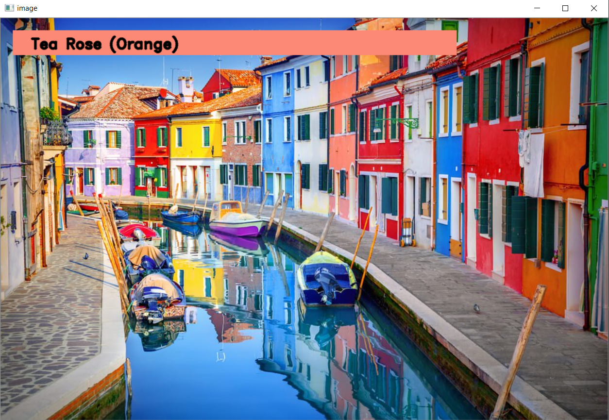

# Color-Detection
Color Detection in an Image

## Packages
* OpenCV 

Wrapper package for OpenCV python bindings.
```bash
pip install opencv-python
```
* Pandas 

Powerful data structures for data analysis, time series, and statistics.
```bash
pip install pandas
```
* argparse 

The argparse module makes it easy to write user friendly command line interfaces.
```bash
pip install argparse
```
## Dataset

Colors are made up of 3 primary colors; red, green, and blue. In computers, we define each color value within a range of 0 to 255. So in how many ways we can define a color? The answer is 256*256*256 = 16,581,375. There are approximately 16.5 million different ways to represent a color. In our dataset, we need to map each color’s values with their corresponding names. But don’t worry, we don’t need to map all the values. We will be using a dataset that contains RGB values with their corresponding names.

The [colors.csv](colors.csv) file includes 865 color names along with their respective RGB and hexadecimal values.

## Run Python File
```bash
python color_detection.py -i <path of image file>
```
## Output

It clearly identifies the color of the selected area in the image.



## Conclusion 

   * Successfully detects the color of the part of the image using computer vision.
   
## License

This project is licensed under the **MIT** License - see the [LICENSE.md](LICENSE)

